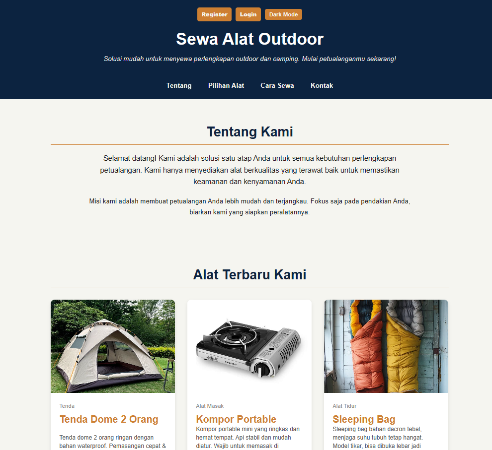

# Nama  : Rusdiansyah
# NIM   : 2409106013
# Kelas : A'24

# Sistem Informasi Sewa Alat Outdoor & Camping

Ini adalah aplikasi web sederhana yang dibangun menggunakan **PHP Native** dan database **MySQL** (via PDO) untuk mengelola sistem penyewaan alat-alat outdoor dan camping.

Aplikasi ini memiliki dua hak akses utama:
1. **User (Pengguna):** Dapat melihat katalog, mendaftar, login, dan melakukan pemesanan (booking).
2. **Admin:** Memiliki dashboard untuk mengelola seluruh data master (alat, kategori, pesanan, dan pengguna).

## Fitur Utama

### Untuk User (Pengguna)
- Autentikasi (Login & Register).
- Melihat katalog produk dengan gambar dan deskripsi.
- Melihat halaman detail untuk setiap produk.
- Melakukan pemesanan alat dengan memilih tanggal sewa dan kembali.
- Fitur Mode Gelap (Dark Mode) yang tersimpan di local storage.

### Untuk Admin
- Login khusus untuk administrator.
- Dashboard statistik (total alat, pesanan aktif, total user).
- Manajemen Kategori (Melihat daftar kategori).
- Manajemen Alat (CRUD - Tambah, Lihat, Edit, Hapus).
- Upload gambar produk saat menambah/mengedit alat.
- Manajemen Pesanan (Melihat daftar pesanan, update status, menghapus pesanan).
- Manajemen Pengguna (Melihat daftar user).

## Teknologi yang Digunakan
- **Backend:** PHP Native (prosedural & OOP-lite)
- **Database:** MySQL (Koneksi menggunakan PDO)
- **Frontend:** HTML5, CSS3, JavaScript (vanilla)
- **Server:** Direkomendasikan menggunakan Laragon atau XAMPP

## Kebutuhan Sistem
- PHP 5.5 atau lebih baru
- MySQL 5.7 atau lebih baru
- Web server (Apache/Nginx)
- Browser modern (Chrome, Firefox, Safari, Edge)

## Cara Instalasi dan Konfigurasi

### 1. Unduh Proyek
Pastikan semua file proyek berada dalam satu folder (misal: `SEWAALATOUTDOOR`).

### 2. Jalankan Server Lokal
Nyalakan server lokal Anda (misal: **Laragon** atau **XAMPP**) dan pastikan MySQL/MariaDB sudah berjalan.

### 3. Import Database
- Buka **phpMyAdmin** (`http://localhost/phpmyadmin`).
- Klik menu **New** untuk membuat database baru.
- Masukkan nama database: `SewaAlatOutdoor`
- Klik **Create**.
- Pilih database `SewaAlatOutdoor`, lalu klik tab **Import**.
- Pilih file `database/SewaAlatOutdoor.sql` dan klik "Go" atau "Kirim".

### 4. Konfigurasi Koneksi Database
- Buka file `config/config.php`.
- Sesuaikan konfigurasi database Anda:
```php
$db_host = 'localhost';
$db_name = 'SewaAlatOutdoor';
$db_user = 'root';        // Default Laragon/XAMPP
$db_pass = '';            // Default Laragon/XAMPP (kosong)
$db_port = 3306;          // Default MySQL port
```

### 5. Jalankan Aplikasi
- Buka proyek Anda di browser: `http://localhost/SEWAALATOUTDOOR/`
- Aplikasi akan otomatis mengarah ke halaman katalog user.

## Akun Demo

### Akun Admin
- **Username:** `admin`
- **Password:** `admin123`

### Akun User Demo
Anda dapat membuat akun pengguna baru melalui halaman Register.

## Struktur Folder

```
SEWAALATOUTDOOR/
│
├── admin/                          # Folder halaman admin
│   ├── categories/                 # Manajemen kategori
│   │   └── categories_list.php     # Daftar kategori
│   │
│   ├── items/                      # Manajemen data alat/produk
│   │   ├── items_action.php        # Handler aksi CRUD items
│   │   ├── items_create.php        # Form tambah item baru
│   │   ├── items_detail.php        # Detail item
│   │   ├── items_edit.php          # Form edit item
│   │   └── items_list.php          # Daftar semua item
│   │
│   ├── rentals/                    # Manajemen pesanan/rental
│   │   ├── booking_action.php      # Handler aksi booking
│   │   ├── rentals_action.php      # Handler aksi rental
│   │   ├── rentals_list.php        # Daftar semua pesanan
│   │   ├── dashboard_home.php      # Dashboard utama admin
│   │   └── dashboard.php           # Halaman dashboard alternatif
│   │
│   ├── users/                      # Manajemen pengguna
│   │   └── users_list.php          # Daftar semua pengguna
│   │
│   └── auth/                       # Autentikasi admin
│       ├── login.php               # Halaman login admin
│       ├── logout.php              # Proses logout admin
│       └── register.php            # Halaman register admin (opsional)
│
├── config/                         # Konfigurasi aplikasi
│   └── config.php                  # Konfigurasi database & koneksi PDO
│
├── database/                       # File database
│   └── SewaAlatOutdoor.sql         # Dump database SQL
│
├── public/                         # Folder asset publik
│   ├── css/                        # File stylesheet
│   │   └── style.css               # Style utama aplikasi
│   │
│   └── images/                     # Folder gambar
│       └── products/               # Gambar produk yang diupload
│           ├── flysheet.jpeg
│           ├── head_lamp_LED.jpeg
│           ├── kompor_portable.jpeg
│           ├── matras_gulung.jpeg
│           ├── sleeping_bag.jpeg
│           └── tenda_camping.jpeg
│
├── uploads/                        # Folder upload cadangan
│
├── js/                             # File JavaScript
│   └── script.js                   # Script untuk dark mode & interaksi
│
└── user/                           # Folder halaman user
    ├── booking/                    # Modul booking/pemesanan
    │   ├── catalog.php             # Halaman katalog produk
    │   ├── detail.php              # Detail produk
    │   └── index.php               # Halaman booking
    │
    ├── auth/                       # Autentikasi user
    │   ├── login.php               # Halaman login user
    │   ├── logout.php              # Proses logout user
    │   └── register.php            # Halaman register user
    │
    └── README.md                   # Dokumentasi user section
```

## Penjelasan Struktur

### **admin/**
Semua halaman yang hanya bisa diakses oleh administrator.
- **categories/**: Kelola data kategori alat
- **items/**: Kelola data alat outdoor (Create, Read, Update, Delete)
- **rentals/**: Dashboard dan manajemen pesanan sewa
- **users/**: Melihat daftar pengguna terdaftar
- **auth/**: Sistem autentikasi untuk admin

### **user/**
Halaman yang dapat diakses oleh pengguna umum.
- **booking/**: Katalog, detail produk, dan proses pemesanan
- **auth/**: Sistem autentikasi user (login dan register)
- Pengguna harus login untuk melakukan booking

### **config/**
Berisi konfigurasi koneksi database menggunakan PDO.

### **database/**
File SQL untuk membuat database dan tabel yang diperlukan.

### **public/**
Asset statis seperti CSS, gambar produk, dan file JavaScript.

### **js/**
File JavaScript untuk logika interaktif aplikasi (dark mode, event handling, dll).

## Cara Penggunaan

### Untuk User (Pengguna):
1. Buka halaman utama aplikasi (`http://localhost/SEWAALATOUTDOOR/`)
2. Daftar akun baru melalui halaman Register
3. Login dengan akun yang telah dibuat
4. Pilih produk dari katalog
5. Klik "Detail" untuk melihat informasi lengkap produk
6. Klik "Sewa Sekarang" dan isi formulir booking
7. Pilih tanggal sewa dan tanggal kembali
8. Konfirmasi pesanan

### Untuk Admin:
1. Akses halaman login admin (`http://localhost/SEWAALATOUTDOOR/admin/auth/login.php`)
2. Login dengan akun admin (username: `admin`, password: `admin123`)
3. Akses dashboard untuk melihat statistik keseluruhan
4. Kelola **Kategori** melalui menu **Categories**:
   - Melihat daftar kategori alat yang tersedia
5. Kelola **Alat** melalui menu **Items**:
   - Tambah alat baru dengan upload gambar
   - Edit informasi alat yang sudah ada
   - Hapus alat yang tidak diperlukan
   - Lihat detail alat
6. Kelola **Pesanan** melalui menu **Rentals**:
   - Lihat semua pesanan yang masuk
   - Update status pesanan (Active/Completed)
   - Hapus pesanan yang sudah selesai
7. Kelola **Pengguna** melalui menu **Users**:
   - Lihat daftar semua pengguna terdaftar

## Fitur Keamanan

- **Password Hashing**: Password disimpan dengan fungsi `password_hash()` PHP
- **Prepared Statements**: Semua query menggunakan PDO prepared statements untuk mencegah SQL Injection
- **Session Management**: Sistem autentikasi menggunakan PHP Session
- **Role-Based Access**: Pemisahan hak akses yang ketat antara User dan Admin

## Environment Config

Untuk production, disarankan membuat file `.env` atau `.env.local` untuk konfigurasi sensitif:
```
DB_HOST=localhost
DB_NAME=SewaAlatOutdoor
DB_USER=root
DB_PASS=
DB_PORT=3306
```

## Catatan Pengembangan

- Aplikasi ini dibuat untuk keperluan pembelajaran dan portfolio
- Struktur kode menggunakan pendekatan prosedural dengan sedikit OOP
- Belum menggunakan framework (PHP Native)
- Untuk production, disarankan menambahkan:
  - CSRF Protection
  - Rate Limiting
  - File Upload Validation yang lebih ketat
  - HTTPS/SSL
  - Environment variables untuk konfigurasi sensitif
  - Input sanitization yang lebih ketat

## Troubleshooting

**Error: "Connection failed"**
- Pastikan MySQL/MariaDB sudah berjalan
- Periksa konfigurasi di `config/config.php`
- Pastikan database `SewaAlatOutdoor` sudah di-import
- Verifikasi username dan password database

**Error: "Call to undefined function password_hash()"**
- Pastikan menggunakan PHP versi 5.5 atau lebih baru
- Ketik `php -v` di terminal untuk mengecek versi PHP

**Error: "Table tidak ditemukan"**
- Pastikan file `database/SewaAlatOutdoor.sql` sudah di-import dengan benar
- Cek ulang nama database di `config/config.php`

**Gambar produk tidak muncul:**
- Periksa path folder `public/images/products/`
- Pastikan file gambar ada di folder tersebut
- Periksa permission folder (chmod 755 untuk Linux/Mac)
- Gunakan path absolut atau relatif yang benar di config

**Session/Login tidak berfungsi:**
- Pastikan session PHP sudah diaktifkan di `php.ini`
- Periksa permission folder untuk session (biasanya `/tmp`)
- Clear browser cookies dan coba login kembali

## Screenshot
